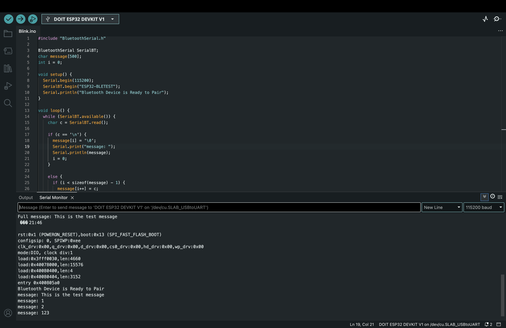
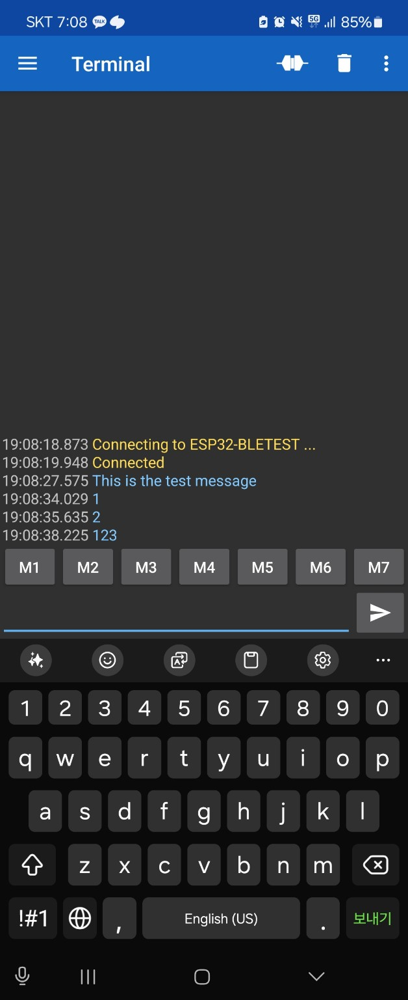

# IoT25-HW04

## Objective  
This assignment demonstrates how to establish a Bluetooth Classic communication channel between an ESP32 and a mobile device using the Serial Bluetooth Terminal app.  
The ESP32 receives full string messages from the mobile device and prints them to the Serial Monitor when a newline character is received.

---

## Arduino IDE Setting  
- **Board**: DOIT ESP32 DEVKIT V1  
- **Port**: /dev/cu.SLAB_USBtoUART



---

## Phone Screenshot  
Below is a screenshot from the Serial Bluetooth Terminal app, showing successful Bluetooth connection and message exchange:



---

## Code

```cpp
#include "BluetoothSerial.h"

BluetoothSerial SerialBT;

char message[500];
int i = 0;

void setup() {
  Serial.begin(115200);
  SerialBT.begin("ESP32-BLETEST");
  Serial.println("Bluetooth Device is Ready to Pair");
}

void loop() {
  while (SerialBT.available()) {
    char c = SerialBT.read();

    if (c == '\n') {
      message[i] = '\0';
      Serial.print("message: ");
      Serial.println(message);
      i = 0;
    } else {
      if (i < sizeof(message) - 1) {
        message[i++] = c;
      }
    }
  }
}
